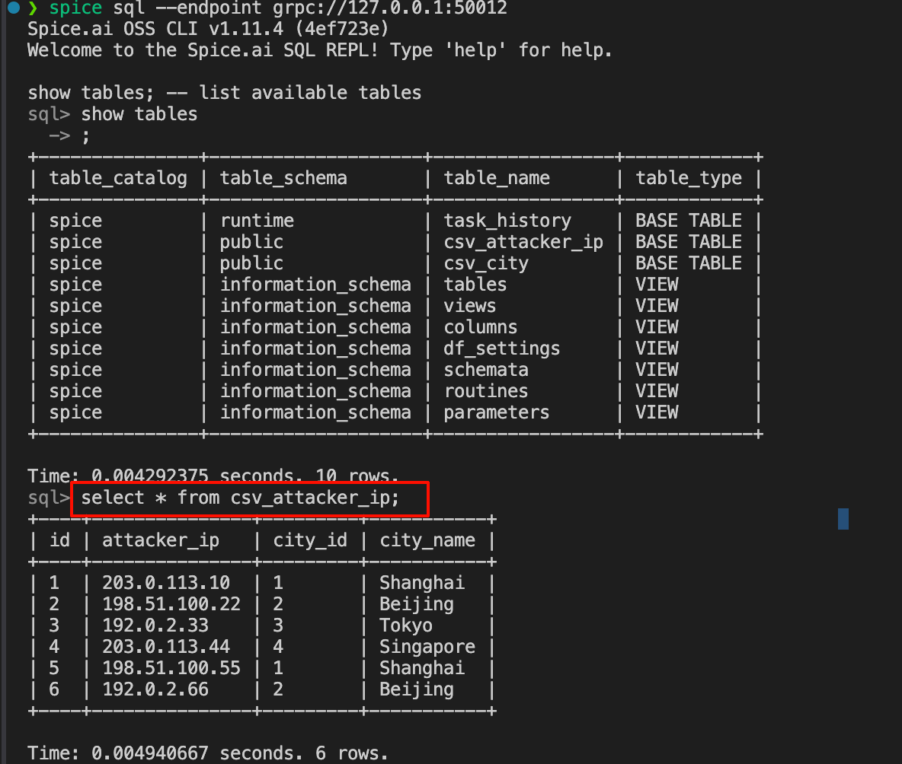

# Spice.ai 调研

## 它是什么

Spice.ai 可以理解成一个面向AI数据应用的基座。他提供如下能力：
- 各类关系型数据源接入能力：支持 PostgreSQL、ClickHouse、CSV、S3中的文件 等多种数据源的接入。（wparse需要的）
  - 统一查询能力
  - 缓存
  - 数据同步能力（将远端数据同步到本地）
- 向量搜索能力：提供基于文本和向量的搜索能力，适合做文档检索、RAG等场景。
- AI Agent：针对于数据应用的AI agent能力，提供 OpenAI 兼容 API 和 MCP API，方便把数据查询、搜索、工具调用等能力暴露给 大模型。

## 应用场景
- 基于系统数据的问答系统。
- 面向数据的分析助手（例如分析财报）。
- 面向知识库或者工单的检索和问答。

## 如何使用
- 统一查询能力
- 面向数据的问答系统
### 统一查询能力
1. 配置好数据源信息
```yml
datasets:
  - from: file:data/attacker_ip.csv
    name: csv_attacker_ip
    params:
      file_format: csv
  - from: file:data/city.csv
    name: csv_city
    params:
      file_format: csv
```
2. 使用其连接工具或者 SQL 接口查询数据

官方文档给出的常见安装方式：


### 面向数据的问答系统
1. 在1的基础上，配置好模型：
```yml
models:
  - from: openai:Pro/zai-org/GLM-4.7
    name: openai_model
    params:
      endpoint: https://api.siliconflow.cn/v1
      openai_api_key: sk-xxx
      tools: auto
```
2. 可以通过其提供的 API 或工具 进行问答


## 资源占用
### 测试场景
我准备了3类数据源：csv、PostgreSQL、ClickHouse。每类数据源我都准备了两张表：主表（`attacker_ip`）和维表（`city`）。主表有1000w行，维表有10w行。主表和维表通过 `city_id` 关联。每个数据源都覆盖 5 类查询，每类测试都对比spice ai方式和原生方式：

1. 任意 IP 查询城市，避免缓存
2. 热点 IP 查询，命中缓存
3. 查询不存在的 IP
4. IP 对应国家 join 查询，避免缓存
5. IP 对应国家 join 查询，命中缓存

**数据规模：**

- 主表数据量：`1000w`
- 城市表数据量：`10w`
- 查询次数：每次查询4个并发，pg查询1w次、ck查询1k次、csv查询100次（慢）
- 单次查询预期返回：`1` 行

**测试流程：**
1. 启动 Spice，并对其进行监控。
2. 重启docker compose（避免缓存）
3. 执行测试查询，记录每次查询的响应时间和系统资源占用情况。

### 测试结论
测试结果在`spice_rust_query/report`中以 Markdown 格式输出。总体来说：
- Spice 在缓存命中的情况下，查询响应时间显著优于原生查询，相比于原生的10倍左右。
- 在没有缓存的情况下，Spice 的查询性能相比于原生，略慢50%左右。
- 资源占用方面，在该场景下CPU占用普遍不超过1%，内存占用在12MB左右，整体来说资源占用较低。
